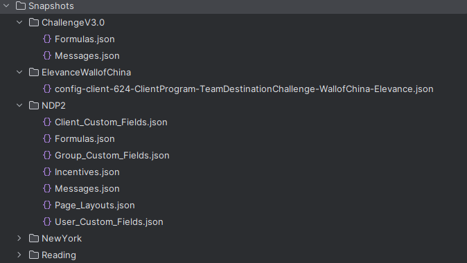
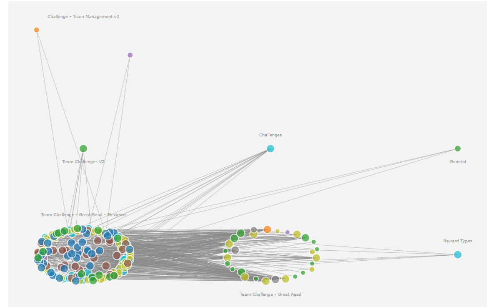

# MHC Config Visualization

Visualize and explore client configuration snapshots as an interactive network graph and export key content to CSV.

## Overview
### Summary
- Reads JSON configuration snapshots from the Snapshots/ folder
- Builds a directed graph of configuration items and their references
- Groups nodes by ClientProgram cluster and renders with Plotly in a Dash app
- Interactive filtering by element type and program
- Detailed node inspection with clickable connections
- Exports selected content (messages, incentives, custom fields, page layout HTML) to Content/ as UTF-8 CSV

### Key files
- main.py: Dash app and UI callbacks
- Click.py: Handles node click interactions and detailed views
- Graph.py: Builds the NetworkX graph and Plotly figure
- Nodes.py: Parses JSON, extracts nodes, content, and references
- Content.py: CSV export helpers for various content types

## How to use
### Download Prerequisites
- Python 3.9+
- Install dependencies: `pip install dash flask plotly networkx`

### Folder structure
- Snapshots/
  - <SnapshotName>/ containing one or more .json files
- Content/ (created automatically) for CSV outputs

### Supported JSON inputs
- Download or export client configuration snapshots from MHC Admin UI
- Either a list of items, or a single object with a _children map of lists
- Nodes.py recognizes these types (by the <<Type:...>> token):
  MessageConfig, ClientTopic, StandaloneFormula, ClientPageLayout, MessageCategory,
  CustomFieldDef, Incentive, Rule, ClientRaffle, ClientReward, ClientProgram, ClientTaskHandlerDefinition, RuleSet

### Run locally
1) Ensure your snapshot JSON files are under Snapshots/<YourSnapshotName>/
2) Start the app:
   `python main.py`
3) Open the app in your browser at http://127.0.0.1:8050 (Localhost or http://localhost:8050)
4) Select or add a snapshot from the dropdown to render the graph
5) Use filtering options to focus on specific elements or programs
6) Click nodes to view detailed information and navigate connections
7) Use the export buttons to write CSVs to Content/

### Adding snapshots
- Create a directory under Snapshots/ named for your snapshot (e.g., Snapshots/MySnapshot)
- Place one or more .json files inside; mixed file names are fine
- The parser extracts references that look like <<Type:Name[...ClientProgram:Program]>>
- Use "Refresh Snapshot List" button to reload available snapshots

### Interactive Features

#### Filtering
- **Filter By Element**: Collapsible section to show/hide specific node types (MessageConfig, Incentive, etc.)
- **Filter By Program**: Dynamically populated based on selected snapshot to filter by ClientProgram
- **Refresh Graph**: Manually refresh the graph display
- All filters work in combination and update the graph in real-time

#### Graph view and interactions
- Nodes are colored by type and clustered by ClientProgram
- Hover shows: name, type, program, references (Refers To / Referred By)
- **Click any node** to view detailed information in the panel below the graph
- Secondary nodes (implied from references but not present in JSON) are labeled with **
- Items whose JSON contained qry are flagged as Query in the hover
- * = Elements could be referenced by non-uploaded elements or by queries
- ** = Implied elements created to represent references to non-uploaded elements (missing context)

#### Node Details Panel
When you click a node, the details panel shows:
- **Basic Info**: Name, Display Name, Type, Program, Query status
- **Content** (collapsible): Type-specific content display
  - Messages: Subject, Notification Text, Body
  - Incentives: Incentive Name, Info
  - Custom Fields: Field Type, Data Type, Default Value
  - Page Layouts: HTML Content
- **Connections** (collapsible): Shows count and clickable lists of:
  - "Refers To": Outgoing connections from this node
  - "Referred By": Incoming connections to this node
- **Raw JSON** (collapsible): Full JSON data for the node (when available)
- All connection names are clickable to jump to related nodes

### CSV exports (buttons)
- Download Message Content → <snapshot>_messages.csv
  Columns: Identification, Program, System Name, Subject, Body, Notification Text, References
- Download Incentive Content → <snapshot>_incentives.csv
  Columns: Identification, Program, System Name, Display Name, Content, References
- Download Custom Fields Content → <snapshot>_custom_fields.csv
  Columns: Identification, Program, System Name, Class Type, Field Type, Default Value, References
- Download Page Layout Content → <snapshot>_page_layouts.csv
  Columns: Identification, Program, System Name, HTML Content, References
  Note: Only HTMLContent sections are exported

Download status is displayed in a status box below the buttons, showing success/error messages.

### Troubleshooting
- No options in the snapshot dropdown: ensure Snapshots/<name>/ exists with .json files, use "Refresh Snapshot List"
- Empty/blank graph: ensure the JSON has recognized nodes, check filtering settings, or check console for errors
- CSV opens with garbled characters: files are UTF-8; in Excel use Import From Text and pick UTF-8
- Disable browser cache if graph doesn't update after changing snapshots (e.g., Chrome DevTools > Network > Disable cache)
- Node details not showing: ensure you're clicking directly on a node (not empty space)

### Notes and limitations
- Edges are created only for references that resolve to known token types
- RuleSet entries with "None" are ignored
- Page layout export includes only non-empty HTMLContent
- The app auto-creates Snapshots/ and Content/ if missing
- Filtering is cumulative - both element type and program filters must be satisfied
- Secondary nodes appear when referenced but not present in the uploaded JSON files

## Disclosures

### Security Implications
- This tool is intended for internal use by MHC employees or authorized individuals only.
- Do not share snapshots or exported content outside of authorized personnel.
- Always run the application in a secure environment to prevent unauthorized access.

### License
- This software and its contents are proprietary to MHC. Use, copying, modification, or distribution is permitted only for current MHC employees or individuals with express written permission from Alex Habegger. All other rights reserved.

