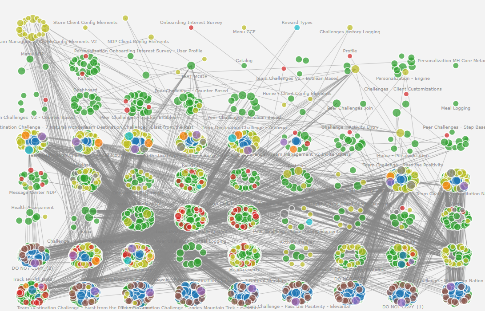
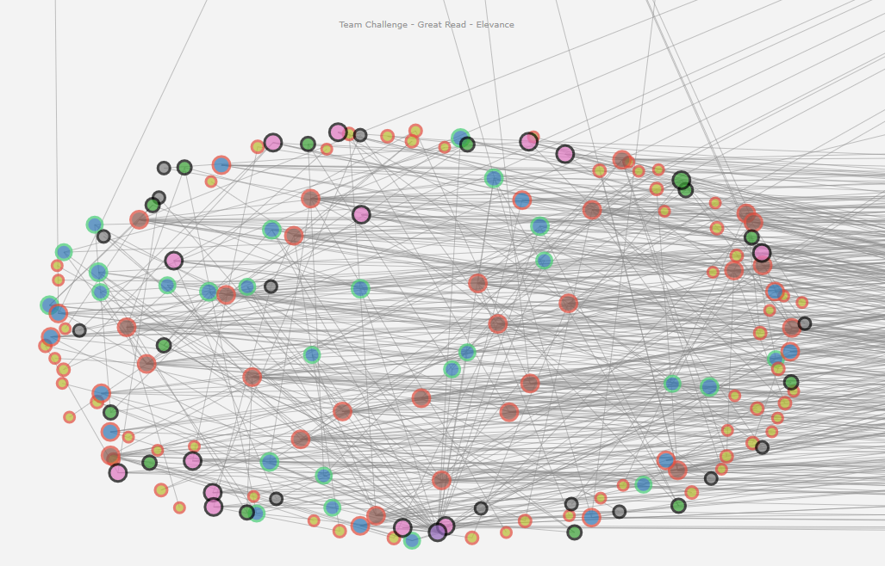
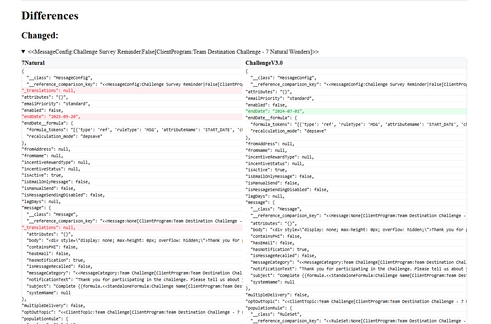
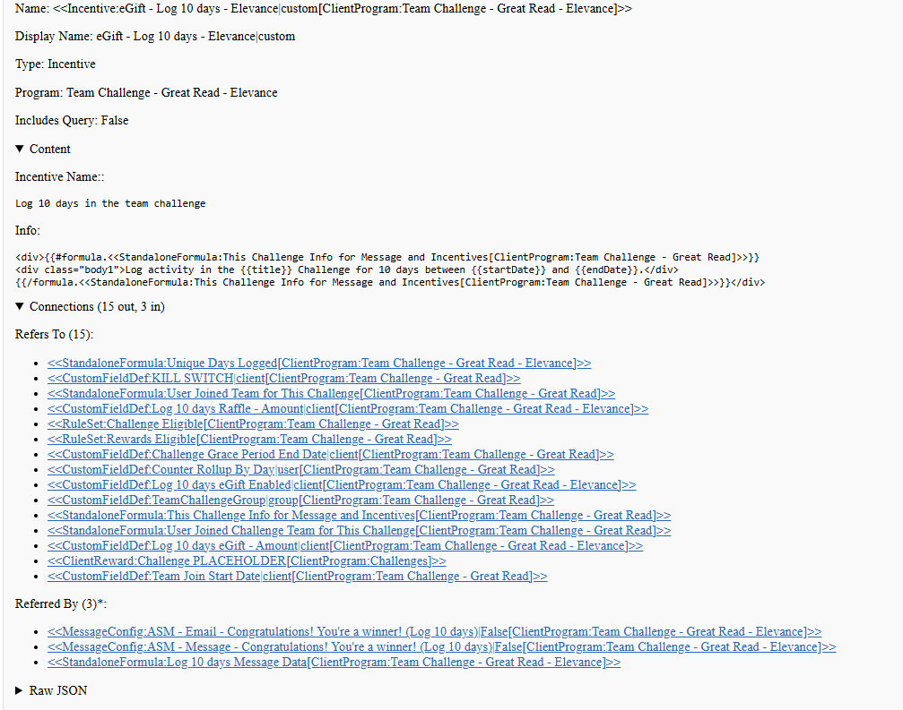
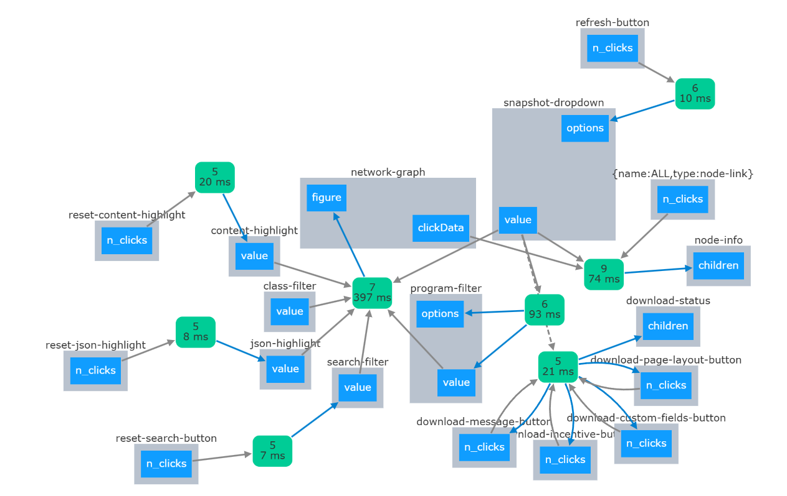

# MHC Config Visualization

Visualize and explore client configuration snapshots as an interactive network graph and export key content to CSV.



## Installation Guide
Follow these steps exactly. If one command fails, read the Troubleshooting section below.

1) Install Python
- Windows: Download and install Python 3.9+ from https://www.python.org/downloads/ (check “Add Python to PATH” during setup).
- macOS: Install from the link above or via Homebrew: `brew install python`.
- Linux: Use your package manager or python.org installer.

2) Get the project onto your computer
- Option A (ZIP): Download this repository as a ZIP from GitHub, then right‑click the ZIP > Extract All… to a folder like Documents\MHC_Config_Visualization.
- Option B (Git):
  - Windows PowerShell: `git clone https://github.com/ahabegger/MHC_Config_Visualization.git`
  - macOS/Linux terminal: `git clone https://github.com/ahabegger/MHC_Config_Visualization.git`

3) Open a terminal in the project folder
- Windows: Right‑click the folder > “Open in Terminal” (or use PowerShell), then run: `cd path\to\MHC_Config_Visualization`
- macOS/Linux: Use Terminal and run: `cd /path/to/MHC_Config_Visualization`

4) (Recommended) Create and activate a virtual environment
- Windows (PowerShell):
  - Create: `py -m venv .venv`
  - Activate: `.venv\Scripts\Activate.ps1`
  - If activation is blocked, run: `Set-ExecutionPolicy -Scope CurrentUser RemoteSigned` once, then try activation again.
- macOS/Linux:
  - Create: `python3 -m venv .venv`
  - Activate: `source .venv/bin/activate`

5) Install dependencies
- All platforms: `pip install -r requirements.txt`
  - If pip isn’t found: try `py -m pip install -r requirements.txt` (Windows) or `python3 -m pip install -r requirements.txt` (macOS/Linux).

6) Run the app
- All platforms: `python main.py`
- If `python` doesn’t work, try `py main.py` (Windows) or `python3 main.py` (macOS/Linux).

7) Open the app in your browser
- Go to http://127.0.0.1:8050 (or http://localhost:8050)

8) Download or export JSON snapshots
- From MHC Admin UI, go to Client Configuration > Download Configuration.
- Select the desired Client Program(s) or Element(s) and click “Configuration JSON” to get a JSON file


9) Upload JSON snapshots
- Place your JSON files in a subfolder under Snapshots/ (e.g. Snapshots/MySnapshot/).
- Each snapshot folder can contain one or more .json files.
- The app auto-creates Snapshots/ and Content/ if they don’t exist.
  - To find the exact Snapshots folder path, see the "Where to add new snapshots" section below.
- Click “Refresh Snapshot List” in the app to see your new snapshot folder.
- The tool recognizes these types (by the <<Type:...>> token):
  MessageConfig, ClientTopic, StandaloneFormula, ClientPageLayout, MessageCategory,
  CustomFieldDef, Incentive, Rule, ClientRaffle, ClientReward, ClientProgram, ClientTaskHandlerDefinition, RuleSet


10) Explore
- Use the Snapshot dropdown to select a snapshot (sample snapshots are included under Snapshots/).
- Use filters to focus the graph. Use the highlighter to search for node conditions. Click nodes to see details. Use the buttons to export CSVs to the Content/ folder.

That’s it. To stop the app, press Ctrl+C in the terminal or shut down the terminal.

---

## Overview
### Summary
- Reads JSON configuration snapshots from the Snapshots/ folder
- Builds a directed graph of configuration items and their references
- Groups nodes by ClientProgram cluster and renders with Plotly in a Dash app
- Interactive filtering by element type and program
- Highlighting nodes by regex match
- Detailed node inspection with clickable connections
- Exports selected content (messages, incentives, custom fields, page layout HTML) to Content/ as CSV
- Snapshot comparison page to visualize two snapshots and list differences

### Key files
- main.py: Dash app and UI callbacks
- Click.py: Handles node click interactions and detailed views
- Graph.py: Builds the NetworkX graph and Plotly figure
- Nodes.py: Parses JSON, extracts nodes, content, and references
- Content.py: CSV export helpers for various content types
- Compare.py: Snapshot diff utilities and compare view wiring

### Prerequisites
- Python 3.9 or newer
- pip (comes with Python)
- Optional: Git (to clone the repository)

### Dependencies
- dash
- flask
- plotly
- networkx

---

## Interactive Features

### Filtering
- Filter By Element: Show/hide specific node types (MessageConfig, Incentive, etc.)
- Filter By Program: Populated from the selected snapshot
- Refresh Graph: Manually refresh the figure
- Filters combine: all selected conditions must be met

### Hightlighting
- Highlight Nodes With RegExp: Enter a regex to highlight matching node names (case-insensitive)
- Clear Highlights: Remove highlighting
- Highlighting changes border color:
  - Green: matches the regex
  - Red: does not match the regex
  - Black: no JSON/content available to test
- For help with Regular Expressions, see https://regex101.com/ or https://regexr.com/ or use ChatGPT to generate patterns.



### Graph view and interactions
- Nodes are colored by type and clustered by ClientProgram
- Hover shows: name, type, program, references (Refers To / Referred By)
- Click any node to view details below the graph
- Secondary nodes (implied from references but not present in JSON) are labeled with **
- Items whose JSON contained qry are flagged as Query in the hover
- * = Elements could be referenced by non-uploaded elements or by queries
- ** = Implied elements created to represent references to non-uploaded elements (missing context)


### Compare snapshots
- From the main page, click “Compare Snapshots →” next to Refresh Graph
- Pick Snapshot A and Snapshot B; two graphs render side-by-side
- Node border colors indicate diff status:
  - Black outline = same in both snapshots
  - Orange outline = present in both but changed
  - Red outline = distinct (only in A or only in B)
- A Differences section lists Added in B, Removed from A, and Changed items




### Node details panel
When you click a node, the details panel shows:
- Basic Info: Name, Display Name, Type, Program, Query status
- Content (collapsible): Type-specific content display
  - Messages: Subject, Notification Text, Body
  - Incentives: Incentive Name, Info
  - Custom Fields: Field Type, Data Type, Default Value
  - Page Layouts: HTML Content
- Connections (collapsible): Counts and clickable lists of Refers To / Referred By
- Raw JSON (collapsible): Full JSON data for the node (when available)
- All connection names are clickable to jump to related nodes



### CSV exports
- Download Message Content → <snapshot>_messages.csv
  Columns: Identification, Program, System Name, Subject, Body, Notification Text, References
- Download Incentive Content → <snapshot>_incentives.csv
  Columns: Identification, Program, System Name, Display Name, Content, References
- Download Custom Fields Content → <snapshot>_custom_fields.csv
  Columns: Identification, Program, System Name, Class Type, Field Type, Default Value, References
- Download Page Layout Content → <snapshot>_page_layouts.csv
  Columns: Identification, Program, System Name, HTML Content, References
  Note: Only HTMLContent sections are exported


Download status is displayed in a status box below the buttons, showing success/error messages.


---

## Troubleshooting
- “python not found” or “pip not found”
  - Windows: Use `py` and `py -m pip ...`. Reinstall Python and check “Add Python to PATH”.
  - macOS/Linux: Use `python3` and `python3 -m pip ...`.
- Can’t activate virtual environment on Windows
  - Open PowerShell as Administrator once and run: `Set-ExecutionPolicy -Scope CurrentUser RemoteSigned`
  - Then close and reopen PowerShell in the project folder, and run `.venv\Scripts\Activate.ps1` again.
- App doesn’t open
  - Check the terminal for errors. Make sure install step completed without errors.
  - Try a different browser: http://127.0.0.1:8050
  - If a firewall prompt appears, allow access for Python on private networks.
- Empty/blank graph
  - Ensure the selected snapshot folder under Snapshots/ contains .json files with recognized node types.
  - Clear filters or click “Refresh Graph”.
- CSV shows strange characters in Excel
  - Files are UTF‑8. In Excel use Data > From Text/CSV and choose UTF‑8 encoding.
- Below is the program's Dash structure if you are customizing or debugging:



### Where to add new snapshots (and how to find the folder)
- Put your JSON files under the Snapshots/ folder. Each snapshot should be in its own subfolder, like:
  - Snapshots/MySnapshot/YourFiles.json
- On app start, the terminal prints the absolute paths for Snapshots/ and Content/.

Find the exact Snapshots folder path using Python (copy one of the following):

- Windows (PowerShell):
  ```powershell
  py -c "import os; print(os.path.abspath('Snapshots'))"
  ```
- Windows (cmd):
  ```bat
  python -c "import os,sys; print(os.path.abspath('Snapshots'))"
  ```
- macOS/Linux (bash/zsh):
  ```bash
  python3 -c "import os; print(os.path.abspath('Snapshots'))"
  ```

Then create a subfolder inside that path and place your .json files there, for example:
- <absolute-path-to-Snapshots>/MySnapshot/ (put .json files here)

Tip: After adding a new folder, click “Refresh Snapshot List” in the app to see it in the dropdown.


### Notes and limitations
- Edges are created only for references that resolve to known token types
- RuleSet entries with "None" are ignored
- Page layout export includes only non-empty HTMLContent
- The app auto-creates Snapshots/ and Content/ if missing
- Filtering is cumulative; element and program filters both apply
- Secondary nodes appear when referenced but not present in the uploaded JSON files
- Regex highlighting is case-insensitive

---

## Disclosures

### Security Implications
This tool is designed to be low risk when used as intended (local machine, authorized data, default settings):
- Local-only processing. It reads JSON files you place under Snapshots/ and writes CSVs to Content/. It does not make outbound network calls, database connections, or telemetry.
- Localhost binding. The built-in Dash/Flask server binds to 127.0.0.1 by default, so it’s not reachable from other machines unless you explicitly change the host.
- No secrets handled. It never prompts for, stores, or transmits credentials, tokens, or keys. It only processes configuration snapshots you already possess.
- Read-only inputs. Source .json files are never modified. The only writes are new CSV files under Content/ and console logs to your terminal.
- No execution of untrusted data. Message bodies and page layout HTML are displayed as text, not executed. Regex/search are evaluated locally against in-memory strings. There is no eval/exec of snapshot content.
- Minimal attack surface. No file uploads over HTTP, no authenticated routes, and no background network services beyond the localhost web UI.
- Operational guidance. Treat snapshots and exported CSVs as confidential; store them on approved machines and share only with authorized personnel. Stop the server by closing the terminal.

Conclusion: Under default settings, this app neither exposes services to the network nor exfiltrates data, and therefore does not present a security risk in typical internal use.

### Contact

For questions or issues, contact Alex Habegger at alexh (at) mobilehealthconsumer (dot) com or on Slack.

### License

This software and its contents are proprietary to MHC. Use, copying, modification, or distribution is permitted only for current MHC employees or individuals with express written permission from Alex Habegger. All other rights reserved.
